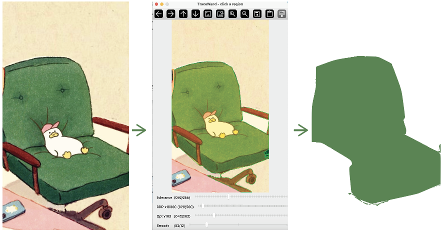

# TraceWand

<p align="center">
  
</p>

TraceWand is an interactive Python tool for selecting a near-color region in an image and exporting the selected region as an optimized SVG path.

The workflow is similar to a magic wand selection tool: open an image, click a point, tune the selection and simplification parameters with sliders, preview the result, then save the current vector output as an SVG.

<p align="center">
  
</p>

## Installation

```bash
sudo apt update
sudo apt install -y build-essential pkg-config libpotrace-dev potrace libagg-dev python3-tk
```

Create and activate a Conda environment:

```bash
conda create -n tracewand python=3.10 -y
conda activate tracewand
```

Install the Python dependencies:

```bash
conda install -c conda-forge opencv numpy svgwrite -y
```

Install `pypotrace`:

```bash
python -m pip install --no-cache-dir pypotrace
```

Verify the environment:

```bash
python -c "import cv2, numpy, svgwrite, potrace; print('ok')"
```

## Usage

Run TraceWand with an image path: (work for both jpg and png)

```bash
python src/tracewand.py path/to/image.jpg
```

Example:

```bash
python src/tracewand.py example_tests/test1.png
```

Controls:

- Left click: choose the seed point for the magic wand selection
- `Tolerance` slider: adjust the color selection range
- `RDP x10000` slider: adjust contour simplification strength
- `Opt x100` slider: adjust Potrace path optimization tolerance
- `Smooth` slider: smooth the contour before RDP simplification
- `S`: save the current preview as an SVG
- `R`: reset the preview
- `Q` or `Esc`: quit

After a seed point is selected, changing the sliders automatically retraces the current selection and updates the preview. SVG files are saved only when `S` is pressed.

The exported SVG keeps the original image dimensions and coordinate system, even though the preview window is scaled for display.

## Command-Line Options

```bash
python src/tracewand.py path/to/image.jpg --tolerance 24 --rdp-factor 0.005 --opt-tolerance 0.4 --smooth 2
```

Available options:

- `--tolerance`: initial flood fill color tolerance
- `--rdp-factor`: initial RDP simplification factor
- `--opt-tolerance`: initial Potrace optimization tolerance
- `--smooth`: initial closed-contour smoothing radius before RDP

## Next Steps

Planned directions for TraceWand include:

- Connecting the selection workflow with SAM (Segment Anything Model) for stronger semantic region selection
- Building plugin integrations for Adobe Illustrator and Figma
- Improving the curve optimization pipeline for cleaner SVG output with fewer nodes
- Refining the interactive UI for faster parameter tuning and previewing

Contributions are welcome. If you are interested in image vectorization, SVG optimization, design-tool plugins, or interactive segmentation workflows, feel free to contribute.

If you run into issues, have suggestions, or have ideas for improving TraceWand, please open an issue or contact me at liuxj0666@gmail.com.

## License

This project is provided for personal, educational, and non-commercial use only.

Commercial use, resale, sublicensing, redistribution for commercial purposes, or inclusion in commercial products or services is not permitted without prior written permission from the author.

## Citation

If you use TraceWand in academic or research work, please cite it as:

```bibtex
@software{tracewand,
  title        = {TraceWand: Interactive Magic-Wand Image Vectorization with Low-Node SVG Optimization},
  author       = {{Xiujin Liu}},
  year         = {2026},
  url          = {https://github.com/XiujinLiu/Tracewind},
  note         = {Personal and non-commercial use only}
}
```